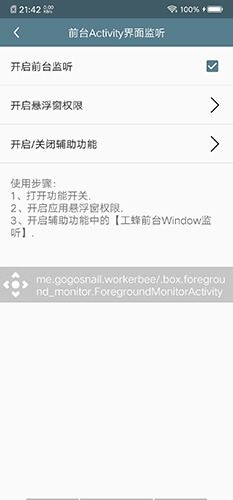

# 工蜂开发者工具箱

集成了常用的开发者工具

## 功能

* [✅] 应用自动安装（支持自动填充安装密码）
* [✅] 悬浮窗展示前台的Activity
* [✅] 测量屏幕的一段距离
* [✅] 开发者常用设置项（快速管理调试的应用、开发者选项等）

### 截图

   

## 添加自己的功能

### 添加一级功能
* FunctionBoxListModel：在功能列表中添加一级功能，指定跳转动作
* functions_box_menu.xml：添加功能名
* res：指定Icon

### 添加子功能集

如果有多个相似的功能需要聚集在一起，可以添加一个聚合的功能列表页.
* FunctionListActivity：指定为改功能集合的跳转页面
* BaseFunctionsFragment：添加子功能集的IFunctionsModel，参考SettingFunctionsModel
* FunctionsItem：定义某个功能的描述信息、跳转页面等内容。

